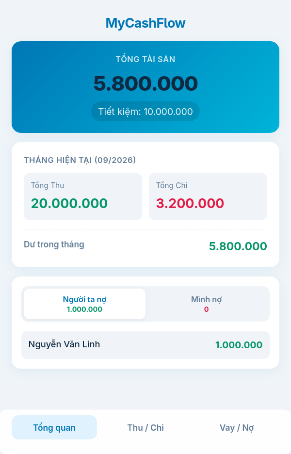

# MyCashFlow 💧

Một công cụ theo dõi tài chính cá nhân tối giản, không phụ thuộc thư viện bên ngoài (zero-dependency), được xây dựng hoàn toàn trên nền tảng Google Sheets và Google Apps Script.

## 🚀 Hướng dẫn triển khai (Deployment)

Làm theo các bước dưới đây để tự tạo một phiên bản MyCashFlow cho riêng bạn.

### Bước 1: Chuẩn bị Cơ sở dữ liệu (Google Sheets)
1. Tạo một bảng tính [Google Sheet](https://sheets.new/) mới.
2. Tạo chính xác **3 trang tính (sheets)** (các tab ở dưới cùng) và đặt tên lần lượt là: `Transactions`, `Debts`, và `Dashboard`.
3. Điền các tiêu đề (headers) và công thức (formulas) chính xác như bảng dưới đây:

#### Trang tính 1: `Transactions`
| Ô (Cell) | Nội dung / Công thức |
| :--- | :--- |
| **A1** | `Date` |
| **B1** | `Type` |
| **C1** | `Amount` |
| **D1** | `Category` |
| **E1** | `Savings` |
| **F1** | `Note` |
| **G1** | `=ARRAYFORMULA(IF(ROW(A:A)=1; "Month"; IF(A:A=""; ""; TEXT(A:A; "yyyy-mm"))))` |

#### Trang tính 2: `Debts`
| Ô (Cell) | Nội dung / Công thức |
| :--- | :--- |
| **A1** | `Date` |
| **B1** | `Action` |
| **C1** | `Amount` |
| **D1** | `Person` |
| **E1** | `Note` |
| **F1** | `=ARRAYFORMULA(IF(ROW(A:A)=1; "Month"; IF(A:A=""; ""; TEXT(A:A; "yyyy-mm"))))` |

#### Trang tính 3: `Dashboard`
| Ô (Cell) | Nội dung / Công thức |
| :--- | :--- |
| **A1** | `Current Month` |
| **B1** | `=TEXT(TODAY(); "MM/yyyy")` |
| **A2** | `Monthly Income` |
| **B2** | `=SUMIFS(Transactions!C:C; Transactions!B:B; "Income"; Transactions!G:G; B1)` |
| **A3** | `Monthly Expense` |
| **B3** | `=SUMIFS(Transactions!C:C; Transactions!B:B; "Expense"; Transactions!G:G; B1)` |
| **A4** | `Monthly Balance` |
| **B4** | `=B2 - B3 - SUMIFS(Transactions!E:E; Transactions!G:G; B1) - SUMIFS(Debts!C:C; Debts!B:B; "Lend"; Debts!F:F; B1) + SUMIFS(Debts!C:C; Debts!B:B; "Collect"; Debts!F:F; B1) + SUMIFS(Debts!C:C; Debts!B:B; "Borrow"; Debts!F:F; B1) - SUMIFS(Debts!C:C; Debts!B:B; "Repay"; Debts!F:F; B1)` |
| **A5** | `Total Balance` |
| **B5** | `=SUMIFS(Transactions!C:C; Transactions!B:B; "Income") - SUMIFS(Transactions!C:C; Transactions!B:B; "Expense") - B6 - SUMIFS(Debts!C:C; Debts!B:B; "Lend") + SUMIFS(Debts!C:C; Debts!B:B; "Collect") + SUMIFS(Debts!C:C; Debts!B:B; "Borrow") - SUMIFS(Debts!C:C; Debts!B:B; "Repay")` |
| **A6** | `Total Savings` |
| **B6** | `=SUM(Transactions!E:E)` |

> ⚠️ **Lưu ý về Định dạng vùng (Locale):** Các công thức trên sử dụng dấu chấm phẩy (`;`), đây là chuẩn chung cho tài khoản ở khu vực Việt Nam/Châu Âu. Nếu tài khoản Google của bạn đang dùng ngôn ngữ/khu vực là chuẩn Mỹ (US), bạn có thể sẽ cần đổi dấu chấm phẩy (`;`) thành dấu phẩy (`,`) để công thức hoạt động đúng.

---

### Bước 2: Cài đặt Apps Script
1. Đứng tại Google Sheet của bạn, trên menu thanh công cụ, nhấn vào **Tiện ích mở rộng (Extensions)** > **Apps Script**.
2. Xóa sạch mọi đoạn code mặc định (nếu có) trong cửa sổ soạn thảo.
3. Tạo một file tên là `Code.gs` và dán toàn bộ nội dung từ file `Code.gs` trong kho lưu trữ (repo) này vào.
4. Nhấn vào biểu tượng `+` bên cạnh chữ "Tệp (Files)", chọn **HTML**, đặt tên là `Index.html`, và dán toàn bộ nội dung từ file `Index.html` của repo này vào.
5. Nhấn biểu tượng **Lưu** (💾) ở thanh công cụ phía trên.

### Bước 3: Phát hành Web App
1. Ở góc trên cùng bên phải của giao diện Apps Script, nhấn nút **Triển khai (Deploy)** > **Bản triển khai mới (New deployment)**.
2. Bấm vào biểu tượng bánh răng ⚙️ bên cạnh "Chọn loại (Select type)" và chọn **Ứng dụng web (Web app)**.
3. Điền các thông tin:
   - **Mô tả (Description):** `MyCashFlow v1.0` (hoặc bất kỳ tên gì bạn thích).
   - **Thực thi dưới dạng (Execute as):** `Tôi (Me)` *(Thiết lập này rất quan trọng để webapp có thể ghi dữ liệu vào Sheet của bạn).*
   - **Người có quyền truy cập (Who has access):** Chọn `Chỉ mình tôi (Only myself)` *(Khuyến cáo để bảo mật tiền bạc của bạn)* HOẶC chọn `Bất kỳ ai (Anyone)` *(Nếu bạn muốn truy cập nhanh mà không cần đăng nhập tài khoản Google trên điện thoại, miễn là bạn không tiết lộ link cho ai khác).*
4. Nhấn nút **Triển khai (Deploy)**.
5. *Hệ thống của Google sẽ yêu cầu cấp quyền (Authorize access). Hãy nhấn "Xem xét quyền", chọn tài khoản Google của bạn, nhấn vào "Nâng cao" (Advanced), và chọn "Đi tới dự án (không an toàn)" để cho phép script có quyền đọc/ghi vào file Google Sheet của bạn.*
6. **Hoàn tất!** Hệ thống sẽ cung cấp cho bạn một đường dẫn (URL) Ứng dụng web. Hãy lưu link này (bookmark) trên trình duyệt điện thoại và chọn tính năng "Thêm vào màn hình chính" (Add to Home Screen) để sử dụng nó như một app thực thụ.
